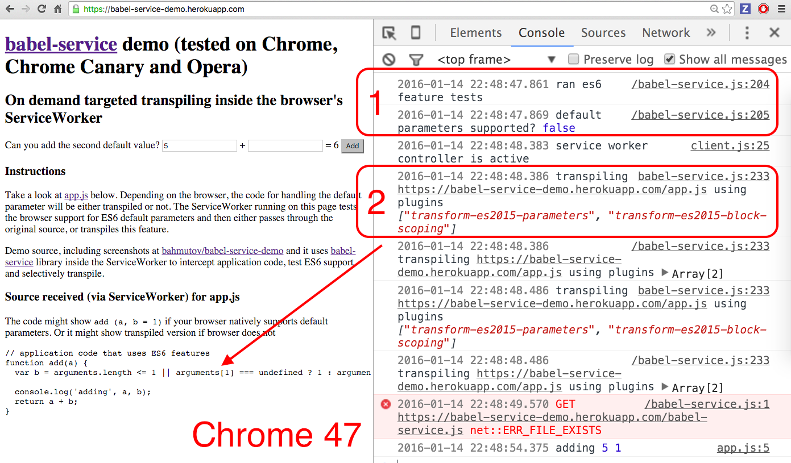
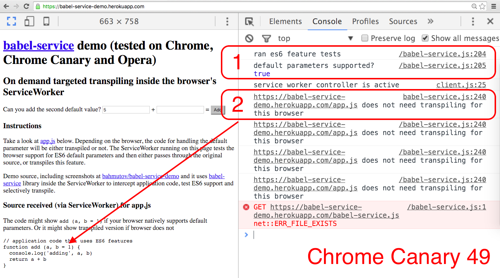

# babel-service
> On demand targeted transpiling inside the browser's ServiceWorker

**ES Feature Tests** + **Babel** = <3 

[![NPM][babel-service-icon] ][babel-service-url]

[![Build status][babel-service-ci-image] ][babel-service-ci-url]
[![semantic-release][semantic-image] ][semantic-url]

## Main idea

ServiceWorker that runs [ES6 feature tests](https://featuretests.io/) and transpiles the 
incoming application code as needed. Each tested feature can map to a Babel plugin.
For example, if the browser already supports ES6 default parameters, then do not transpile them!

## Demo

You can see demo at 
[https://babel-service-demo.herokuapp.com](https://babel-service-demo.herokuapp.com/). Make sure
to use a modern browser with ServiceWorker support (Chrome, Chrome Canary, Opera). Firefox
should work if you enable a flag, but I had problem running Babel JS inside Firefox.

What you should see: once a page registers a `babel-service` ServiceWorker, it should reload
itself. The ServiceWorker will intercept a file `app.js` that contains a ES6 source code that uses 
[default parameters](https://developer.mozilla.org/en-US/docs/Web/JavaScript/Reference/Functions/Default_parameters).

```js
// app.js
function add (a, b = 1) {
  console.log('adding', a, b)
  return a + b
}
```

If your browser already supports them natively, the code will be returned from the `babel-service` 
unchanged. If your browser does NOT support default parameters, the source code
will be transpiled using Babel.

### Screenshots

The downloaded `app.js` is appended at the bottom of the page for clarity. First, the Chrome 47
without default parameter support - it gets the transpiled version.



On the other hand, Chrome Canary 49 already supports default parameters and does not need this
feature transpiled



## Details

[Feature testing](https://github.com/getify/es-feature-tests) code taken from 
[this source file](https://github.com/getify/es-feature-tests/blob/master/lib/featuretests.js).
It runs when the ServiceWorker is installed.

Babel.js was built from [babel-standalone](https://www.npmjs.com/package/babel-standalone)

## Related

* [compiled](https://github.com/bahmutov/compiled) - same idea as `babel-service`, but for Node.
  You write ES6, make a bundle and determine the ES6 features. Then every client when installing
  runs targeted transpile. `compiled` is the simplest way to write ES6 code today without
  mangling it to death before running.

### Small print

Author: Gleb Bahmutov &copy; 2015

* [@bahmutov](https://twitter.com/bahmutov)
* [glebbahmutov.com](http://glebbahmutov.com)
* [blog](http://glebbahmutov.com/blog/)

License: MIT - do anything with the code, but don't blame me if it does not work.

Spread the word: tweet, star on github, etc.

Support: if you find any problems with this module, email / tweet /
[open issue](https://github.com/bahmutov/babel-service/issues) on Github

## MIT License

Copyright (c) 2015 Gleb Bahmutov

Permission is hereby granted, free of charge, to any person
obtaining a copy of this software and associated documentation
files (the "Software"), to deal in the Software without
restriction, including without limitation the rights to use,
copy, modify, merge, publish, distribute, sublicense, and/or sell
copies of the Software, and to permit persons to whom the
Software is furnished to do so, subject to the following
conditions:

The above copyright notice and this permission notice shall be
included in all copies or substantial portions of the Software.

THE SOFTWARE IS PROVIDED "AS IS", WITHOUT WARRANTY OF ANY KIND,
EXPRESS OR IMPLIED, INCLUDING BUT NOT LIMITED TO THE WARRANTIES
OF MERCHANTABILITY, FITNESS FOR A PARTICULAR PURPOSE AND
NONINFRINGEMENT. IN NO EVENT SHALL THE AUTHORS OR COPYRIGHT
HOLDERS BE LIABLE FOR ANY CLAIM, DAMAGES OR OTHER LIABILITY,
WHETHER IN AN ACTION OF CONTRACT, TORT OR OTHERWISE, ARISING
FROM, OUT OF OR IN CONNECTION WITH THE SOFTWARE OR THE USE OR
OTHER DEALINGS IN THE SOFTWARE.

[babel-service-icon]: https://nodei.co/npm/babel-service.png?downloads=true
[babel-service-url]: https://npmjs.org/package/babel-service
[babel-service-ci-image]: https://travis-ci.org/bahmutov/babel-service.png?branch=master
[babel-service-ci-url]: https://travis-ci.org/bahmutov/babel-service
[semantic-image]: https://img.shields.io/badge/%20%20%F0%9F%93%A6%F0%9F%9A%80-semantic--release-e10079.svg
[semantic-url]: https://github.com/semantic-release/semantic-release
